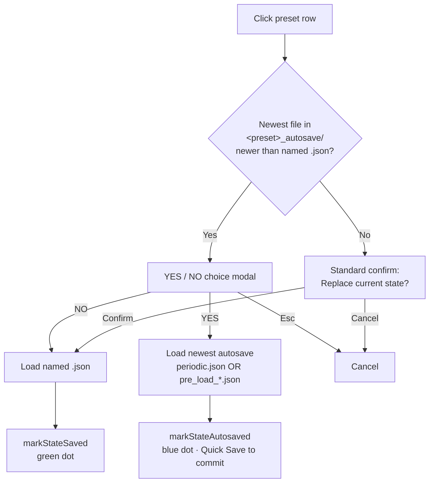

# Snapshot dialogs — redesign sketch

Working sketch for consolidating the Snapshot Settings cog into the Save and
Load dialogs, plus the related "load the newest autosave, whichever file it
is" fix. Discussion-only — not implemented yet.

Pixel mockups (current vs. proposed) live in
[`snapshot-dialogs.html`](snapshot-dialogs.html).

## What changes

1. **Toolbar:** the `pi pi-cog` Settings button is removed from the Snapshot
   row. The row becomes: status indicator · Load · Quick Save · Save.
2. **Save dialog:** library path inlined as an editable line at the top
   ("Save to: `<folder>` · Change…"). Reuses the existing browse picker.
3. **Load dialog:** library path inlined at the top alongside the existing
   `📂 Open` button ("Loading from: `<folder>` · Change… · 📂 Open").
4. **Autosave-newer YES/NO modal:** server's row-augment step extends from
   stat-only-`periodic.json` to `max(periodic.json mtime, max(pre_load_*.json
   mtime))` so the YES button always loads whichever recovery file is freshest.

## Load flow (post-redesign)

The current code path is identical except the `B` branch only considers
`periodic.json`; pre-load files (often newer than periodic) are hidden in
the Recovery section. After the fix the YES button loads whichever
recovery file is newest, regardless of which capture mechanism wrote it.

## Out of scope (deliberately, for this PR)

- Multi-library support
- Per-snapshot library binding
- Bulk migrate-presets-to-new-folder action
- Recent-libraries dropdown

The single-library design is documented intent ([curated-sidebar.md
§ library directory](../maintainers/curated-sidebar.md)). The redesign
only consolidates surface, it does not change the model.
