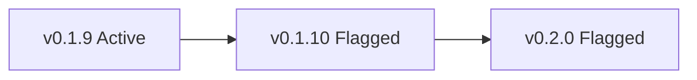

# Project conventions

Cross-cutting rules that apply anywhere in the repo — docs, issues,
PRs, commit messages, agent output. Topic-specific procedures live in
their own `docs/maintainers/<topic>.md`; this file is for the rules
that don't have a single home.

## Diagrams: use Mermaid

When producing a diagram (architecture sketch, sequence flow, decision
tree, version-state graph), render it as a fenced `mermaid` block.
Write:

    ```mermaid
    flowchart LR
      A[v0.1.9 Active] --> B[v0.1.10 Flagged]
      B --> C[v0.2.0 Flagged]
    ```

Which renders on GitHub as:



Why: the maintainer reviews diagrams visually, and a Mermaid block is
easier to read than ASCII art or paragraph prose. GitHub renders
Mermaid natively in `.md` files, issue / PR bodies, and discussions.

Apply in:

- markdown docs under `docs/`
- `CHANGELOG.md` entries explaining a structural change
- issue / PR bodies where a flow or state graph would clarify
- release-notes drafts

In-app caveat: Claude Code's desktop file-preview panel does **not**
render Mermaid (open feature request
[anthropics/claude-code#14375](https://github.com/anthropics/claude-code/issues/14375));
the diagram only renders when viewed on GitHub or in Obsidian. So the
working loop is "write Mermaid → push or open in Obsidian to verify
rendering."

## Modal headers: title only, no descriptive subtitle

Every dialog box in the sidebar (Save, Load, Folder picker, Settings,
Confirm, Input, …) keeps the header clean: **title text only**. An
explanatory one-liner like *"Where snapshots are saved and loaded
from."* below the title creates more noise than signal — if the title
isn't self-explanatory, rephrasing the title is the fix, not adding a
sentence underneath.

Where the gloss is genuinely useful:

- **Title hover tooltip** — pass it as `titleTooltip` to
  `makeModalShell` / the dialog's caller-facing API. The user discovers
  it on mouseover when they need it; clutter-free otherwise.
- **Info icon** beside the title — same idea, more discoverable but
  more visual weight. Use only when the gloss is genuinely needed for
  first-time use (rare).

What is **not** a "descriptive subtitle" and stays as-is:

- **Functional info rows** in the dialog body — the "Saved to: `<path>`
  · Change…" library-path line in Save / Load. These are part of the
  *interaction surface*, not the header, and the snapshot-dialogs
  redesign mockup explicitly puts them inside the body card.
- **Subtitles that show live state** — async-loading library info, etc.

Why: dialogs need to read at a glance. The mockups in
[`docs/designs/`](../designs/) treat the header as a single line for
exactly this reason; implementations must match. The first time the
maintainer flagged this was the snapshot folder picker rendering
"Where snapshots are saved and loaded from." as a subtitle, which the
mockup did not show.

How to apply when implementing or updating a dialog: pass the title
text as the visible header and route any explanatory copy to
`titleTooltip`. If a dialog helper doesn't accept `titleTooltip` yet,
plumb it through (see `makeModalShell` in `web/sidebar/modals.js` for
the pattern).
