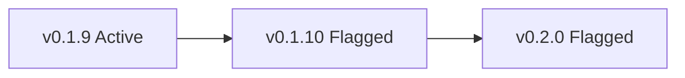

# Project conventions

Cross-cutting rules that apply anywhere in the repo — docs, issues,
PRs, commit messages, agent output. Topic-specific procedures live in
their own `docs/maintainers/<topic>.md`; this file is for the rules
that don't have a single home.

## Diagrams: use Mermaid

When producing a diagram (architecture sketch, sequence flow, decision
tree, version-state graph), render it as a fenced `mermaid` block.
Write:

    ```mermaid
    flowchart LR
      A[v0.1.9 Active] --> B[v0.1.10 Flagged]
      B --> C[v0.2.0 Flagged]
    ```

Which renders on GitHub as:



Why: the maintainer reviews diagrams visually, and a Mermaid block is
easier to read than ASCII art or paragraph prose. GitHub renders
Mermaid natively in `.md` files, issue / PR bodies, and discussions.

Apply in:

- markdown docs under `docs/`
- `CHANGELOG.md` entries explaining a structural change
- issue / PR bodies where a flow or state graph would clarify
- release-notes drafts

In-app caveat: Claude Code's desktop file-preview panel does **not**
render Mermaid (open feature request
[anthropics/claude-code#14375](https://github.com/anthropics/claude-code/issues/14375));
the diagram only renders when viewed on GitHub or in Obsidian. So the
working loop is "write Mermaid → push or open in Obsidian to verify
rendering."
