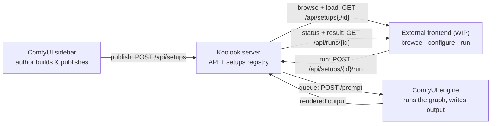
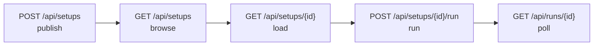

# The publish → run loop (architecture overview)

This is the high-level map of how a *published setup* gets from authoring in
ComfyUI to running on a Comfy server through an external frontend. It is the
entry point that ties the detailed setup docs together — read this first for
the shape of the loop, then follow the links for storage, schema, and contract
detail.

Related docs:

- [`published-setups.md`](published-setups.md) — storage, validation, routes, implementation detail.
- [`published-setup-external-ui-contract.md`](published-setup-external-ui-contract.md) — the product/design contract behind the external frontend surface.
- [`published-setup-full-circle-plan.md`](published-setup-full-circle-plan.md) — what is implemented vs. remaining work.
- [`external-frontend-kit.md`](external-frontend-kit.md) / [`setup-runner-quickstart.md`](setup-runner-quickstart.md) — building and exercising a frontend.

---

## The loop, in plain terms

A "setup" is a published, externally-runnable workflow. The loop has two halves
that meet at the Koolook server.

The publish edge is one-way into the registry; the run / queue / output / status
edges form the loop, with the Koolook server mediating both the frontend and the
engine.

**1. Publish (one-way, into the registry).** An author builds a workflow in the
Kforge Labs sidebar, drops in Koolook *publish-contract* nodes, and right-clicks
→ **Publish setup**. Koolook captures three things — the visual graph, ComfyUI's
executable `apiPrompt`, and an inferred UI surface (`setupSurface.app`) — and
`POST`s the record to the server, which writes it into the setups registry
(`setups.json`). The setup is now a stable, addressable thing with an `id`.

**2. Run (the loop).** Any frontend on the same machine talks to the Koolook
HTTP API:

| Step   | Endpoint                          | What happens                                            |
| ------ | --------------------------------- | ------------------------------------------------------- |
| Browse | `GET /koolook/api/setups`         | catalog of published setups (valid only)                |
| Load   | `GET /koolook/api/setups/{id}`    | full record incl. `setupSurface.app` → renders the form |
| Run    | `POST /koolook/api/setups/{id}/run` | user inputs injected into `apiPrompt`, queued on engine |
| Poll   | `GET /koolook/api/runs/{runId}`   | status until terminal → returns result path             |

The Koolook server is the hub: it injects submitted values into the stored
prompt, prunes unselected router branches, queues it on the **same local
ComfyUI server's** `/prompt`, lets the engine run with its installed nodes, and
`Koolook_PublishOutput` writes the files where the user asked. The frontend just
renders a form and polls — it never needs to understand the graph.

**Why this makes a future frontend possible:** the frontend depends only on the
*published record shape* (surface + contract + endpoints), not on ComfyUI
internals. Any external UI that speaks those four endpoints can drive renders.
The governing rule: **don't invent a separate external-app format — the file an
external app reads is the same record `GET /api/setups/{id}` returns.**

---

## Technical map

Three layers — frontend JS → Koolook aiohttp server → ComfyUI engine. Request
flow across the loop:

### Frontend — browser JS (`web/`)

| File                            | Symbol                                          | Role                                        |
| ------------------------------- | ----------------------------------------------- | ------------------------------------------- |
| `sidebar/published_surface.js`  | `showPublishSetupModal()`                       | publish dialog; collects metadata + contract |
| `sidebar/canvas_io.js`          | `captureWorkflowApiPrompt()`, `serializeFullCanvas()` | exports executable `apiPrompt` + `visualGraph` |
| `sidebar/published_setups.js`   | `publishSavedWorkflowSetup()`                   | `POST` → `/koolook/api/setups`              |
| `setup_runner_simulator.js`     | renders `setupSurface.app`, run + poll          | **WIP** stand-in / contract test for the future frontend |

### Koolook server — Python · aiohttp (`koolook_routes.py` › `register_routes()`)

| Method · path                       | Handler                       | Role                              |
| ----------------------------------- | ----------------------------- | --------------------------------- |
| `POST /koolook/api/setups`          | `publish_setup()`             | validate + persist record         |
| `GET  /koolook/api/setups`          | `list_published_setups()`     | catalog (valid only)              |
| `GET  /koolook/api/setups/{id}`     | `get_published_setup()`       | full record incl. `apiPrompt`     |
| `POST /koolook/api/setups/{id}/run` | `run_published_setup()`       | inject inputs, prune routers, queue |
| `GET  /koolook/api/runs/{id}`       | `get_published_setup_run()`   | poll status + result summaries    |

Behind the routes:

| File                       | Symbol                                              | Role                                       |
| -------------------------- | --------------------------------------------------- | ------------------------------------------ |
| `koolook_setups.py`        | `PublishedSetupRegistry`, `validate_setup()`        | schema v1; status `valid` / `draft` / `invalid` |
| `koolook_setup_runner.py`  | `PublishedSetupRunner`, `AiohttpComfyClient`, `InMemorySetupRunStore` | prune branches → `POST /prompt`; run ids `run-000001` |
| `koolook_setup_runner.py`  | `FileSetupStorage`                                  | on-disk registry at `…/koolook-published-setups/setups.json` |

### ComfyUI engine (same local server)

| Method · path           | Role                                          |
| ----------------------- | --------------------------------------------- |
| `POST /prompt`          | queue prompt; executes graph with installed custom nodes |
| `GET /history`, `/queue`| status source — runner derives running / done / `lost` |

Graph contract nodes: `Koolook_PublishInput` · `Koolook_PublishOutput` ·
`Koolook_PublishRouter` · `Koolook_PublishResult` — input injection, output
write, branch select, custom result path.

---

## Requirements & contracts

- **Contract nodes in the setup** — `Koolook_PublishInput` (required),
  `Koolook_PublishOutput` (required), `Koolook_PublishRouter` (optional switch),
  `Koolook_PublishResult` (optional result path). Defined in
  [`k_publish_contract.py`](../../k_publish_contract.py).
- **Record shape** (`schemaVersion: 1`) — `id` · `metadata` · `visualGraph` ·
  `apiPrompt` · `inputContract` · `outputContract` · `setupSurface.app` ·
  `source` · `validation`.
- **Validation** — `validation.status ∈ {valid, draft, invalid}`; a `valid`
  record must carry an `apiPrompt`.
- **Run contract** — body `{ "inputs": { … } }` → `{ runId, promptId, status }`;
  poll returns terminal status + result paths.
- **One format only** — the file an external app reads === the record
  `GET /api/setups/{id}` returns. Do not create an external-app-only format.

---

## Implementation notes worth knowing

- **Routes register independently of nodes.** `koolook_routes.install()` runs
  even when a node module fails to import, so the setup/preset API stays up when
  a node is broken.
- **Run ids are in-memory** (`InMemorySetupRunStore`, `run-000001…`). They do
  not survive a ComfyUI restart; a poll for a missing run returns a terminal
  `lost` status. Persisted run history is listed as remaining work in the
  full-circle plan.
- **The simulator is the contract test.** `setup_runner_simulator.html/.js`
  renders from `setupSurface.app` exactly as the real frontend must, so it
  doubles as the build-against reference. It is a maintainer harness, not the
  production frontend.

## Status

The core loop (publish → registry → load → run → poll → result) is implemented
(PRs 231 / 233 / 235). Remaining "future" work: the production external frontend
itself (auth, job list, run history, multi-user) and the publish-modal
simplification — see
[`published-setup-full-circle-plan.md`](published-setup-full-circle-plan.md).
